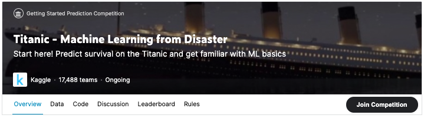
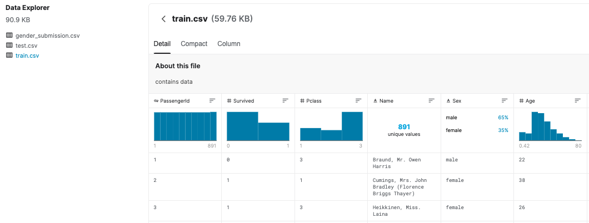
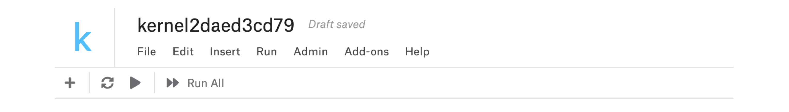

# 01 Titanic - Machine Learning from Disaster  泰坦尼克号 - 灾难中的机器学习

## 一、创建编程环境之前

### ① 参加比赛

首先要做的就是参加比赛！ 打开一个包含竞赛页面的新窗口，然后单击黑色的“加入竞赛”按钮（如果尚未）。 （如果看到“提交预测”按钮而不是“参加比赛”按钮，则表明已经参加比赛，无需再次参加。）

如图所示：

### ② 比赛题目

使用泰坦尼克号乘客数据（姓名、年龄、票价等）来尝试预测谁会生存，谁会死亡。

### ③ 数据分布

要查看比赛数据，请单击比赛页面顶部的“数据”选项卡。 然后，向下滚动以查找文件列表。

比赛用到数据有三个文件：

- （1）train.csv、

- （2）test.csv 

- （3）gender_submission.csv

train.csv 包含机上乘客的详细信息（确切地说是 891 名乘客 - 每个乘客在表中都有不同的行）。 要查看数据的详细内容，请单击屏幕左侧的文件名。 完成此操作后，可以在窗口中查看所有数据

train.csv的详细数据分布如下图：

第二列（“幸存”）中的值可用于确定每位乘客是否幸存：

- 如果是“1”，则乘客幸存。
- 如果是“0”，则乘客死亡。

例如，train.csv 中列出的第一位乘客是 Owen Harris Braund 先生。 他死于泰坦尼克号时年仅22岁

使用在train.csv中找到的数据分布模式，你需要预测其他418名乘客（在test.csv中）是否幸存

点击屏幕左侧的test.csv以查看其内容。请注意，test.csv没有一个名为"Survived"的列 - 这些信息对你是隐藏的，你在预测这些隐藏值方面的表现将决定在竞赛中得分的高低

gender_submission.csv文件提供了一个例子，显示了你应该如何构建你的预测。它预测所有女性乘客幸存，而所有男性乘客死亡。关于生存的你的假设可能会不同，这将导致一个不同的提交文件。但是，就像这个文件一样，你的提交应该包含：

- 一个包含来自test.csv每位乘客的ID的"PassengerId"列。
- 一个（由你创建的）"Survived"列，在你认为乘客幸存的行中为"1"，在你预测乘客死亡的行中为"0"。

## 二、创建编程环境

在这一部分，你将训练自己的机器学习模型以改善你的预测。如果你以前从未编写过代码或对机器学习没有任何经验，不用担心！在本教程中，我们不假设任何先前的经验。

### ① 创建一个Kaggle Notebook（笔记本）
首先，要做的是创建一个Kaggle笔记本，你将在其中存储所有的代码。你可以使用Kaggle笔记本快速上手编写代码，而无需在计算机上安装任何东西。（如果你对深度学习感兴趣，我们还提供免费的GPU访问！）

首先，在竞赛页面上点击"Code"选项卡。然后，点击"New Notebook"。

创建的笔记本样式如下图所示：

### ② 