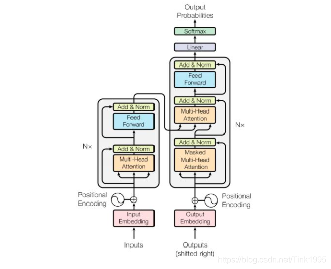

# ⑥ Transformer模型架构各层详解

注：本文仅介绍最原始的Transformer模型架构，不涉及任何改进方法。

## 一、什么是Transformer？

以下是Transformer模型的整体架构图：

Transformer 是一种深度学习模型架构，用于处理序列数据，特别是在自然语言处理（NLP）任务中取得了巨大成功。它于2017年由Vaswani等人在论文《Attention is All You Need》中首次提出。在这之前，循环神经网络（RNN）和长短时记忆网络（LSTM）等传统的循环结构在序列建模中非常流行，但在处理长序列时存在一些限制。最开始只有模型的含义，经过几年的发展，Transformer现如今已成为一个基本架构，并衍生出许多改进方法（简称：**魔改**）

## 二、Transformer的表层分析

在不深究微观内层，只从表面上看，和大多数seq2seq模型一样，transformer的结构也是由encoder（编码器）和decoder（解码器）两部分组成。下面，我们将分别且详细地介绍encoder（编码器）和decoder（解码器）这两部分内部的各层网络。

## 三、Transformer的内层分析

### 3.1 Encoder

Encoder是**自然语言序列**映射为**隐藏层**的过程。

#### ① Positional Encoding层

Positional Encoding 层是Transformer模型的一个重要组成部分。Positional Encoding（位置编码）是Transformer模型中用于为输入序列中的每个位置添加一些信息，以便模型能够捕捉输入序列的顺序信息的一种技术。由于自注意力机制并不关注输入序列的顺序，为了让模型能够理解序列中单词的相对位置，需要引入位置编码，才能让模型按照人类输入的序列的顺序进行位置识别。

在Transformer模型中，位置编码是通过将固定模式的数学函数添加到输入的嵌入表示中来实现的。常用的位置编码函数包括正弦函数和余弦函数。这些函数可以生成一个独特的编码向量，该向量包含了有关位置信息的信息。

