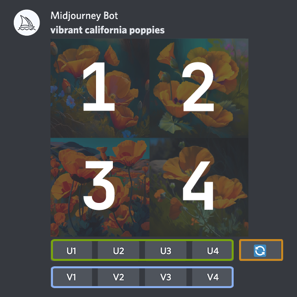

# Midjourney教程汇总

## 一、入门

### 1、使用Midjourney bot进行画图前的激活bot词

**①**、使用 /imagine，这个指令可以用来激活Midjourney bot进行图像生成.

**②**、输入 /imagine prompt: 或者从\ 指令弹框选择 /imagine 指令.

**③**、请在prompt字段中输入一个简短而具体的描述.
按下回车键发送消息指令.

**注意**：指令只能在专门的bot频道中使用。命令在普通的频道中是无效的，例如#trial-support

### 2、生成图片后的各参数解释

**U**按钮升级图像质量，生成选定图像的较大尺寸版本并优化更多细节呈现
**V**按钮将对选定网格图像的进行细微变体的生成。创建变体后会生成一个新的图像网格，与所选图像的整体风格和构图相似