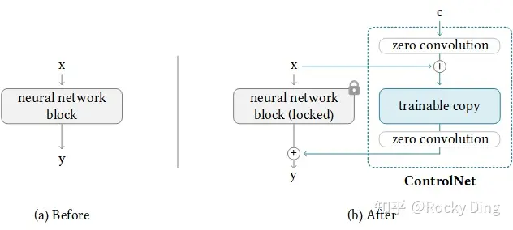

# stable-diffusion教程汇总

## 一、Prompt 要素

stable-diffusion的Prompt要素分为以下几点：**画质**、**画风**、**主体**、**主体属性**、**主体特征：衣着**、**姿势**、**场景特征**、**环境特征**、**画面视角**、**反面提示词**

### 1、画质

**画质**一般分为以下几种类型：

**通用型**：best quality, ultra-detailed,masterpiece,hires, 8k

**特定型**：比如 extremely detailed CG unity 8k wallpaper（超精细的8K Unity游戏CG），unreal engine rendered（虚幻引擎渲染）

### 2、画风

**画风**一般分为以下几种类型

**插画风**：Painting、Illustration、drawing
**二次元**：Anime、Comic、Game CG
**写实风**：Photorealistic、Realistic
**漫画风**：comic
**Q版**：chibi

等等........

### 3、主体

**主体**一般分为以下几种类型：

**人**

**物**

**风景**

**场景**

**物体**

**其他**

### 4、主体属性

主要是描述主题的一些特征，如果是人，那么他的高矮胖瘦，五官等等，主要会根据下面几个方面编写：

人物类型：人、职业...
身材
头发
五官
举个例子：画一个萝莉(loli)，比较瘦(thin)，穿着大衣(wear overcoat clothes),短马尾(short ponytail)，红色的头发(red hair)，得意的笑(smirk)，狐狸耳朵（fox ears），爱心眼(heart-shaped pupils)，有一个尾巴(tail)

## 二、

## 三、ControlNet核心基础原理

ControlNet是一种“辅助式”的神经网络模型结构，通过在Stable Diffusion模型中添加辅助模块，从而引入“额外条件”来控制AI绘画的生成过程。

下图是ControlNet模型的最小单元：

    ControlNet模型的最小单元结构示意图

从上图可以看到，在使用ControlNet模型之后，Stable Diffusion模型的权重被复制出两个相同的部分，分别是“锁定”副本和“可训练”副本。

ControlNet主要在“可训练”副本上施加控制条件，然后将施加控制条件之后的结果和原来SD模型的结果相加（addd）获得最终的输出结果。

其中“锁定”副本中的权重保持不变，保留了Stable Diffusion模型原本的能力；与此同时，使用额外数据对“可训练”副本进行微调，学习我们想要的添加的条件。没有任何权重是从头开始训练的，所以我们使用小批量数据集就能对控制条件进行学习训练，同时不会破坏Stable Diffusion模型原本的能力。

另外，大家可能发现了ControlNet模型的最小单元结构中有两个zero convolution模块，它们是1×1卷积，并且权重和偏置都初始化为零。这样一来，在我们开始训练ControlNet之前，所有zero convolution模块的输出都为零，使得ControlNet完完全全就在原有Stable Diffusion底模型的能力上进行微调训练，不会产生大的能力偏差。

这时很多人可能就会有一个疑问，如果zero convolution模块的初始权重为零，那么梯度也为零，ControlNet模型将不会学到任何东西。那么为什么“zero convolution模块”有效呢？

我们看一下下面的推导，一切都会非常清晰明了：

我们可以假设ControlNet的权重为：
 ，然后我们就可以得到对应的梯度求导：

如果此时
 并且
, 然后我们就可以得到：

这就意味着只要
, 一次梯度下降迭代将使
 变成非零值。然后就得到：
 。这样就能让zero convolution模块逐渐成为具有非零权重的公共卷积层，并不断优化参数权重。

所以，如果我们不使用ControlNet模型时，可以将图像生成过程表达为：

我们假设将训练的所有参数锁定在
 中，然后将其克隆为可训练的副本
 。复制的
使用外部条件向量
 进行训练。制作副本而不是直接训练原始权重主要是为了避免数据集较小时的过拟合，并保持从数十亿张图像中学习到的大型模型的能力。

所以在使用ControlNet之后，整体的图像生成表达式转化成为：

其中
 代表了zero convolution模块，
 和
 代表zero convolution的参数权重，
 代表ControlNet的参数权重。

由于训练开始前zero convolution模块的输出都为零，所以ControlNet未经训练的时候输出为0：

这种情况下对SD模型是没有任何影响的，就能确保SD模型原本的性能完整保存，之后ControlNet训练也只是在原SD模型基础上进行优化。ControlNet模型思想使得训练的模型鲁棒性好，能够避免模型过度拟合，并在针对特定问题时具有良好的泛化性，在小规模甚至个人设备上进行训练成为可能。

3. ControlNet核心网络结构解析
   在上一章中，Rocky带大家学习了ControlNet核心基础原理与ControlNet最小单元，接下来Rocky将和大家详细讲解完整ControlNet核心网络结构。

我们从ControlNet整体的模型结构上可以看出，其主要在Stable Diffusion的U-Net中起作用，ControlNet主要将Stable Diffusion U-Net的Encoder部分进行复制训练，在Stable Diffusion U-Net的Decoder模块中通过skip connection加入了zero convolution模块处理后的特征，以实现对最终模型与训练数据的一致性。

由于ControlNet训练与使用方法是与原始的Stable Diffusion U-Net模型进行连接，并且Stable Diffusion U-Net模型权重是固定的不需要进行梯度计算。这种设计思想减少了ControlNet在训练中一半的计算量，在计算上非常高效，能够加速训练过程并减少GPU显存的使用。在单个Nvidia A100 PCIE 40G的环境下，实际应用到Stable Diffusion模型的训练中，ControlNet仅使得每次迭代所需的GPU显存增加大约23%，时间增加34%左右。

具体地，ControlNet包含了12个编码块和1个Stable Diffusion U-Net中间块的“可训练”副本。这12个编码块有4种分辨率，分别是64×64、32×32、16×16和8×8，每种分辨率对应3个编码块 。ControlNet的输出被添加到Stable Diffusion U-Net的12 个残差结构和1个中间块中。同时由于Stable Diffusion U-Net是经典的U-Net结构，因此 ControlNet架构有很强的兼容性与迁移能力，可以用于其他扩散模型中。

还有一点大家可能会疑惑，ControlNet一开始的输入Condition怎么与SD模型的隐空间特征结合呢？在这里ControlNet主要是训练过程中添加了四层卷积层，将图像空间Condition转化为隐空间Condition。这些卷积层的卷积核为4×4，步长为2，通道分别为16，32，64，128，初始化为高斯权重，并与整个ControlNet模型进行联合训练。

初始Condition转化成隐空间Condition的过程
总的来说，ControlNet的架构与思想，让其可以对图像的背景、结构、动作、表情等特征进行精准的控制。

4. ControlNet 1.1核心基础知识详解
   ControlNet 1.1 与 ControlNet 1.0 具有完全相同的架构。

ControlNet 1.1在ControlNet 1.0的基础上进行了优化，提高了鲁棒性和控制效果，同时添加了几个新的ControlNet模型。

从ControlNet 1.1开始，ControlNet模型开始有标准的命名规则（SCNNR）来命名所有模型，这样我们在使用时也能更加方便。

具体的命名规则如下图所示：

ControlNet 1.1一共发布了14个模型（11个成品模型和3 个实验模型）：

control_v11p_sd15_canny
control_v11p_sd15_mlsd
control_v11f1p_sd15_depth
control_v11p_sd15_normalbae
control_v11p_sd15_seg
control_v11p_sd15_inpaint
control_v11p_sd15_lineart
control_v11p_sd15s2_lineart_anime
control_v11p_sd15_openpose
control_v11p_sd15_scribble
control_v11p_sd15_softedge
control_v11e_sd15_shuffle（实验模型）
control_v11e_sd15_ip2p（实验模型）
control_v11f1e_sd15_tile（实验模型）
5. 从0到1在WebUI中使用ControlNet进行AI绘画（全网最详细讲解）
目前ControlNet有18种Control Type，分别是Canny，Depth，NormalMap，OpenPose，MLSD，Lineart，SoftEdge，Scribble/Sketch，Segmentation，Shuffle，Tile/Blur，Inpaint，InstructP2P，Reference，Recolor，Revision，T2I-Adapter，IP-Adapter。

从上面的Control type可以看出，ControlNet无疑引领了CV领域的“文艺复兴”，很多传统图像处理时代的算子（Canny，Depth，SoftEdge等）在AIGC时代中再次展现它们的能量。

下面，Rocky将为大家介绍如何在WebUI中安装使用ControlNet，并且详细讲解18种Control type的用法。

5.1 零基础使用Stable Diffusion WebUI搭建ControlNet推理流程
首先，我们进入WebUI的extensions目录下，并在命令行输入一下命令即可安装ControlNet插件：

cd stable-diffusion-webui/extensions/

git clone https://github.com/Mikubill/sd-webui-controlnet.git
安装完毕后，重启WebUI即可看到ControlNet插件面板：

WebUI中ControlNet插件面板
接下来详细介绍ControlNet插件面板中各个参数的具体作用:

ControlNet插件面板第一行中的ControlNet Unit 0-3表示默认设置为三个ControlNet选项界面，能够在Stable Diffusion生成过程中使用三个ControNet模型，可以手动增加或减少ControlNet选项界面。

ControlNet插件面板第二行有Single Image和Batch两个选项卡，表示使用一张图片或一个Batch的图片进行预处理，用于ControlNet过程。

Enable（启用）：点击选择Enable后，点击WebUI中的Generate按钮时，将会加载ControlNet模型辅助控制图像的生成过程。如果不点击选择Enable按钮不生效。

Low VRAM（低显存模式）：如果我们的显卡显存小于4GB，可以开启此选项降低生成图片时ControlNet的显存占用。

Pixel Perfect（完美像素模式）：开启完美像素模式之后，ControlNet 将自动计算选择预处理器分辨率，不再需要我们手动设置分辨率。通过自动进行这些调整，它可以保证最高的图像质量和清晰度。Rocky在这里打一个不太恰当的比喻，ControlNet的Pixel Perfect功能，就如同YOLOv5的自适应anchor一样，自动化为我们的参数调整免去了很多麻烦。

Allow Preview（预览展示模式）：启用后将会把图片经过Preprocessor预处理后的结果展示出来，比如图片的边缘信息，深度信息，关键点信息等。

开启和不开启Allow Preview形成的区别
Control Type（控制类型）：一共有18种控制类型可以选择，选择一个Control Type后，Preprocessor和Model栏里也会限定只能选择与Control Type相匹配的算法和模型，非常方便。

Preprocessor（预处理器）：在Preprocessor栏里我们可以选择需要的预处理器，每个预处理器都有不同的功能。选择的预处理器会先将上传的图片进行预处理，例如Canny会提取图片的边缘特征信息。如果图片不需要进行预处理，设置Preprocessor为none即可。

Model（模型）：Model栏里我们可以选择ControlNet模型，用于SD生成图片时进行控制。

Control Weight（ControlNet权重）：代表使用ControlNet模型辅助控制SD生成图片时的权重。

Starting Control Step（引导介入时机）：表示在图片生成过程中的哪一步开始使用ControlNet进行控制。如果设置为0，就表示从一开始就使用ControlNet控制图片的生成；如果设置为0.5就表示ControlNet从50%的步数时开始进行控制。

Ending Control Step（引导推出时机）：表示在图片生成过程中的哪一步结束ControlNet的控制。和引导介入时机相对应，如果设置为1，表示使用ControlNet进行控制直到完成图片的生成。Ending Control Step默认为1，可调节范围0-1，如果设置为0.8时表示到80%的步数时结束控制。

Control Mode（控制模式）：在使用ControlNet进行控制时，有三种控制模式可以选择，用于确定ControlNet于Prompt之间的配比。我们可以选择平衡二者 (Balanced)，或是偏重我们的提示词 (My prompt is more important)，亦或者是偏重ControlNet (ControlNet is more important)。

Rocky为大家详细讲解一下三种控制模式的原理：

"Balanced"（平衡）：ControlNet的能力在CFG Scale中均衡的使用，一般我们默认可以选择Balanced。
"My prompt is more important"（我的提示更重要）：ControlNet的能力在CFG Scale中使用，但逐渐减少在SD U-Net模型的注入（layer_weight *=
，其中0<=I<13，13表示ControlNet注入了SD 13次）。在这种情况下，提示词Prompt在图像的生成过程中占据更大的比重。
"ControlNet is more important"（ControlNet更重要）：ControlNet仅在CFG Scale的条件控制部分使用。这意味着如果我们设置的CFG Scale是X，那么ControlNet的控制强度将是X倍（如果我们设置CFG Scale为7，那么ControlNet的强度将是7倍）。需要注意的是，这里的X倍强度与“Control Weights”（控制权重）不同，因为ControlNet的权重没有被修改。这种“更强”的效果通常会产生较少的人工痕迹，并且给ControlNet更多空间去猜测我们的提示词中缺少的内容（在之前的版本，这个模式被称为"Guess Mode"）。
下图是是三种控制模式的效果对比：

ControlNet三种Control Mode的效果对比
Resize Mode（缩放模式）：用于调整图像大小模式，一共三个选项：Just Resize，Crop and Resize和Resize and Fill。

我们拿512x500的图像为例，使用三个缩放模式生成一个 1024x1024的图像，看看主要经过了哪些过程：

Just Resize：不考虑宽高比，直接将图像拉伸成1024x1024分辨率。

Crop and Resize：考虑宽高比，先将图片裁剪至 500x500，然后缩放至1024x1024分辨率，会造成左右两侧的一些数据丢失。

Resize and Fill：通过添加噪音的方式将图像填充至512x512，然后缩放到1024x1024分辨率。

Loopbac按钮：[Loopback] Automatically send generated images to this ControlNet unit。点击开启后，在mov2mov等持续性生成过程中，每一帧的结果都会进行ControlNet控制。

Presets：用于保存已经配置好的ControlNet参数，以便后续快速加载相关参数。

5.2 Canny使用详解
Canny边缘检测算法能够检测出原始图片中各对象的边缘轮廓特征，提取生成线稿图，作为SD模型生成时的条件。

接着再设置不同的提示词，让SD模型生成构图相同但是内容不同的画面，也可以用来给线稿图重新上色。

使用Canny边缘检测算法进行图像预处理的结果
Canny算法中一共有2种Preprocessor，分别是Canny和invert (from white bg & black line)。

如果输入的图像具有白色背景和黑色线条，我们可以使用invert，其效果如下图所示：

使用invert进行图像预处理的结果
Canny中一共有10种ControlNet模型可以选择，包括coadapter-canny-sd15v1，control_any3_canny，control_sd15_canny，control_canny-fp16，control_v11p_sd15_canny，controlnet-canny-sdxl-1.0，diff_control_sd15_canny_fp16，sdxl_canny_fp16，t2iadapter_canny_sd14v1，t2iadapter_canny_sd15v2。

下面我们来看看，在所有参数相同的情况下，不同Canny ControlNet的效果如何：

（1）coadapter-canny-sd15v1模型

使用Canny coadapter-canny-sd15v1模型控制生成
（2）control_any3_canny模型

control_any3_canny模型主要用于二次元图像的控制生成。

使用Canny control_any3_canny模型控制生成
（3）control_sd15_canny模型和control_canny-fp16模型

下面的control_sd15_canny模型是ContolNet官方发布的模型，其与control_canny-fp16模型的控制效果基本一致。control_sd15_canny模型大小约为5.3G，control_canny-fp16模型是其量化版本，模型大小只有689M。显存较为紧张的读者，Rocky这边推荐可以使用control_canny-fp16模型平替control_sd15_canny模型。

使用Canny control_sd15_canny模型控制生成

使用Canny control_canny-fp16模型控制生成
（4）control_v11p_sd15_canny模型

control_v11p_sd15_canny模型是ControlNet官方发布的Canny增强模型，具备较好的控制力。

使用Canny control_v11p_sd15_canny模型控制生成
（5）diff_control_sd15_canny_fp16模型

使用Canny diff_control_sd15_canny_fp16模型控制生成
（6）t2iadapter_canny_sd14v1模型和t2iadapter_canny_sd15v2模型

最后是使用t2iadapter_canny系列的两个模型进行图像的控制生成。可以看到，使用t2iadapter_canny_sd14v1模型控制生成的图片整体色调更加深沉，而使用使用t2iadapter_canny_sd15v2模型控制生成的图片光影与整体质感更加明亮通透。

使用Canny t2iadapter_canny_sd14v1模型控制生成

使用Canny t2iadapter_canny_sd15v2模型控制生成
5.3 Depth使用详解
Depth算法通过提取原始图片中的深度信息，能够生成和原图一样深度结构的深度图。其中图片颜色越浅（白）的区域，代表距离镜头越近；越是偏深色（黑）的区域，则代表距离镜头越远。

Depth算法一共有四种预处理器，分别是depth_leres，depth_leres++，depth_midas和depth_zoe。

这四种预处理器的效果分别如下所示：

（1）depth_leres预处理器效果

depth_leres预处理器的成像焦点在中间景深层，这样的好处是能有更远的景深，且中距离物品边缘成像会更清晰，但近景图像的边缘会比较模糊。

depth_leres预处理器效果
（2）depth_leres++预处理效果

depth_leres++预处理器在depth_leres预处理器的基础上做了优化，能够有更多的细节。

depth_leres++预处理效果
（3）depth_midas预处理效果

depth_midas预处理器是经典的深度估计器，也是最常用的深度估计器。

depth_midas预处理效果
（4）depth_zoe预处理效果

depth_zoe预处理效果

5.4 NormalMap使用详解
NormalMap算法根据输入图片生成一张记录凹凸纹理信息的法线贴图，通过提取输入图片中的3D法线向量，并以法线为参考重新生成一张新图，同时给图片内容进行更好的光影处理。法线向量图指定了一个表面的方向。在ControlNet中，它是一张指定每个像素所在表面方向的图像，法线向量图像素代表的不是颜色值，而是表面的朝向。

NormalMap算法的用法与Depth算法类似，都是用于传递参考图像的三维结构特征。NormalMap算法与Depth算法相比在保持几何形状方面有更好的效果，在深度图中很多细微细节并不突出，但在法线图中则比较明显。

法线贴图在游戏制作领域用的较多，常用于贴在低模上模拟高模的复杂光影效果，非常适合CG建模师。

NormalMap算法一共有两种预处理器，分别是normal_bae预处理器和normal_midas预处理器，具体效果如下所示：

（1）normal_midas预处理效果

Normal_Midas预处理方法是经典的预处理方法，在NormalMap算法中指的是从Midas方法获得的深度贴图估计法线贴图的过程。法线贴图详细说明了表面的方向，对于ControlNet来说，它决定了图像中每个像素所代表的表面的方向。虽然Midas主要用于深度估计，在ControlNet中，它被用来推导法线贴图，Midas法线图擅长将主体从背景中分离出来。

normal_midas预处理效果
（2）normal_bae预处理效果

Normal_Bae预处理器用于估计法线贴图，重点是解决了aleatoric不确定性问题，对图像的背景和前景都进行细节的渲染，这样能够较好完善法线贴图中的细节内容，建议默认使用这个预处理器。

normal_bae预处理效果
5.5 OpenPose使用详解
OpenPose算法包含了实时的人体关键点检测模型，通过姿势识别，能够提取人体姿态，如人脸、手、腿和身体等位置关键点信息，从而达到精准控制人体动作。除了生成单人的姿势，它还可以生成多人的姿势，此外还有手部骨骼模型，解决手部绘图不精准问题。

如下图所示，我们输入图像和Prompt，通过OpenPose算法精准识别后，得到骨骼姿势图，再用SD模型的文生图功能，通过Prompt描述主体内容、场景细节和画风后，就能得到一张同样姿势，但风格完全不同的人物图片：

ControlNet OpenPose算法使用效果图示
OpenPose算法一共有六种预处理器，分别是OpenPose，OpenPose_face，OpenPose_faceonly，OpenPose_full，openpose_hand，dw_openpose_full。

每种OpenPose预处理器的具体效果如下：

（1）OpenPose预处理器效果

OpenPose预处理器是OpenPose算法中最基础的预处理器，能够识别图像中人物的整体骨架（眼睛、鼻子、眼睛、脖子、肩膀、肘部、腕部、膝盖和脚踝等），效果如下图所示：

openpose预处理效果图
（2）OpenPose_face预处理器效果

OpenPose_face预处理器是在OpenPose预处理器的基础上增加脸部关键点的检测与识别，效果如下所示：

openpose_face预处理效果图
（3）OpenPose_faceonly预处理器效果

OpenPose_faceonly预处理器仅检测脸部的关键点信息，如果我们想要固定脸部，改变其他部位的特征的话，可以使用此预处理器，效果如下图所示：

OpenPose_faceonly预处理效果图
（4）OpenPose_full预处理器效果

openpose_full预处理器能够识别图像中人物的整体骨架+脸部关键点+手部关键点，是一个非常全面的预处理器，其效果如下所示：

openpose_full预处理效果图
（5）openpose_hand预处理器效果

openpose_hand预处理器能够识别图像中人物的整体骨架+手部关键点，效果如下所示：

openpose_hand预处理效果图
（6）dw_openpose_full预处理器效果

dw_openpose_full预处理器是目前OpenPose算法中最强的预处理器，是OpenPose_full预处理器的增强版，使用了传统深度学习中的王牌检测模型yolox_l作为人体关键点的检测base模型，其不但能够人物的整体骨架+脸部关键点+手部关键点，而且精细程度也比openpose_full预处理器更好，其效果如下图所示：

dw_openpose_full预处理效果图
dw_openpose_full预处理器中使用的DWPose模型效果如下：

动图封面
DWPose模型效果
5.6 MLSD使用详解
MLSD是一种线条检测算法，通过分析图片的线条结构和几何形状来构建出建筑外框（直线），它对于提取具有直边的轮廓非常有用，例如室内设计、建筑物、街景、相框和纸张边缘，但是对人或其它有弧度的物体边缘提取效果很差。

如果我们想要对室内、建筑等输入图片进行重构，原图环境中有人物出现，但是新生成的图片中不希望有人物，那么使用MLSD算法就可以很好的避开人物线条的检测，从而能够生成纯建筑的新图片。

总的来说，ControlNet MLSD算法非常适合用于室内设计、建筑设计等场景。

（1）mlsd预处理效果

ControlNet mlsd预处理效果
（2）mlsd_invert预处理效果

ControlNet mlsd_invert预处理效果
目前ControlNet官方发布的MLSD模型一共有两个，分别是control_sd15_mlsd模型和control_v11p_sd15_mlsd模型，下面我们看看用control_v11p_sd15_mlsd模型+二次元SD模型和真实场景SD模型的控制生成效果：

ControlNet MLSD模型+二次元SD模型和真实场景SD模型的控制生成效果
5.7 Lineart使用详解
ControlNet Lineart算法（线稿模型）与Canny算法大同小异，可以检测出输入图像中的线稿信息。

Lineart算法一共有五种预处理器，分别是lineart_anime预处理器、lineart_anime_denoise预处理器、lineart_coarse预处理器、lineart_realistic预处理器和lineart_standard 预处理器。

下面是Lineart算法各预处理器的具体效果：

Lineart_anime预处理器：用于生成动漫风格的线稿/素描信息。
Lineart_anime_denoise预处理器：Lineart_anime预处理器的优化版，在提取动漫风格线稿/素描信息的同时进行降噪处理。
Lineart_coarse预处理器：用于生成粗糙线稿/素描，线条相比较于其它预处理器，的确更粗一些，效果也很不错，生成的图像则趋于真实。
Lineart_realistic预处理器：能较好地提取人物线稿部分。
Lineart_standard(from white bg&black line)预处理器：是一种特殊模式，将白色背景和黑色线条的图像转换为线稿或素描，能较好的还原场景中的线条，跟原图较为相似。
（1）lineart_anime预处理效果

lineart_anime预处理效果
（2）lineart_anime_denoise预处理效果

lineart_anime_denoise预处理效果
（3）lineart_coarse预处理效果

lineart_coarse预处理效果
（4）lineart_realistic预处理效果

lineart_realistic预处理效果
（5）lineart_standard 预处理效果

lineart_standard 预处理效果
（6）lineart_invert预处理效果

lineart_invert预处理效果

5.8 SoftEdge使用详解
ControlNet SoftEdge算法的主要作用是检测图像的软边缘轮廓，与Canny算法相比检测出的边缘轮廓没有那么细致和严格，相对比较宽松和柔性，让我们在AI绘画过程中有更大的灵活性与更多的创意空间。在传统图像处理领域，图像边缘指的是图像中颜色或亮度变化显著的地方，对应着物体与背景之间、或者物体与物体之间的交界。通过检测出图像边缘信息，我们可以提取出图像中的形状、纹理、结构等重要信息，进一步用于AI绘画、AIGC、传统深度学习、智能驾驶等领域的后续任务。

SoftEdge算法一共有四种Preprocessor，分别是softedge_hed预处理器、softedge_hedsafe预处理器、softedge_pidinet预处理器以及softedge_pidinetsafe预处理器，其中带有“safe”字样的表示精简版。

softedge_hed预处理器跟Canny算法类似，也是一种边缘检测算法，可以把Canny算法理解为用铅笔提取边缘，而softedge_hed预处理器则是换用毛笔，被提取的图像边缘将会非常柔和，细节也会更加丰富，绘制的人物明暗对比明显，轮廓感更强，适合在保持原来构图的基础上重新着色和对画面风格进行改变。

如果是生成棱角分明或者机甲一类的图像，我们推荐使用Canny算法。如果是想要生成人物和动物等图像，使用softedge_hed预处理器效果会更好。

同样的，softedge_pidinet预处理器也是一种边缘检测算法，比起softedge_hed预处理器，它的泛化性与鲁棒性更强。

下面是基于softedge_hed预处理器的图像控制生成过程：

（1）softedge_hed预处理效果

softedge_hed预处理效果
（2）softedge_hedsafe预处理效果

softedge_hedsafe预处理效果
（3）softedge_pidinet预处理效果

softedge_pidinet预处理效果
（4）softedge_pidisafe预处理效果

softedge_pidisafe预处理效果
总的来说，SoftEdge算法的所有分支的性能表现如下所示：

鲁棒性：SoftEdge_PIDI_safe > SoftEdge_HED_safe >> SoftEdge_PIDI > SoftEdge_HED

最好效果上限：SoftEdge_HED > SoftEdge_PIDI > SoftEdge_HED_safe > SoftEdge_PIDI_safe

一般情况下，我们默认使用 SoftEdge_PIDI。大多数情况下它的效果都很好。

5.9 Scribble/Sketch使用详解
Scribble/Sketch算法能够提取图片中曝光对比度比较明显的区域，生成黑白稿，涂鸦成图，其比Canny算法的自由度更高，也可以用于对手绘线稿进行着色处理。

从下图可以看到提取的涂鸦，不但保留了曝光度对比较大的部分，而且细节保留的也很不错。细节保留的越多，那么SD重新生成图片时所能更改的部分就越少。

当然的，我们也可以直接上传涂鸦，然后通过Scribble/Sketch算法进行补充绘图。

ControlNet Scribble/Sketch算法一共有四种预处理器，分别是：scribble_hed预处理器、scribble_pidinet预处理器、scribble_xdog预处理器以及t2ia_sketch_pidi预处理器。

scribble_hed预处理器：由Holistically-Nested Edge Detection(HED) 边缘检测器构成，擅长生成像真人一样的轮廓，能够配合SD系列模型进行图像进行重新着色和重新设计样式等任务。
scribble_pidinet预处理器：由Pixel Difference network(Pidinet) 网络构成，能够检测图像中曲线和直线边缘等特征。其结果与scribble_hed预处理器类似，但通常会产生更清晰的线条和更少的细节。
scribble_xdog预处理器：由EXtendedDifferenceofGaussian(XDoG)技术构成，同样是一种图像边缘检测算法。与其他预处理器不同的是，scribble_xdog预处理器附带一个XDoG Threshold参数可供我们调整阈值，这让我们的控制效果更佳精细化。
t2ia_sketch_pidi预处理器：t2ia_sketch_pidi预处理器在处理涂鸦图像时考虑一些特定的因素，例如涂鸦的形状、颜色、纹理等，以帮助算法更好地理解和利用图像中的信息（待确认补充）。
接下来我们再看看各个预处理器的效果，具体如下所示：

（1）scribble_hed预处理效果

ControlNet scribble_hed预处理效果
（2）scribble_pidinet预处理效果

ControlNet scribble_pidinet预处理效果
（3）scribble_xdog预处理效果

ControlNet scribble_xdog预处理效果
（4）t2ia_sketch_pidi预处理效果

ControlNet t2ia_sketch_pidi预处理效果
5.10 Segmentation使用详解
Segmentation算法是传统深度学习三大支柱（分类，分割，检测）核心之一，主要通过对图片内容（人物、背景、建筑等）进行语义分割，可以区分画面色块，适用于大场景的画风更改。

但是输入图像的所有精细细节和深度特征都会丢失，与此同时会生成多个与输入图像中的物体的形状基本保持一致的mask（掩膜）。ControlNet中的Segmentation算法天然地能够与SD系列模型的inpatinting相结合使用，后者需要输入mask，并对mask部分进行局部重绘，而Segmentation算法就能够自动提供相应的mask部分。

Segmentation算法一共有三种预处理器，分别是seg_ofade20k预处理器、seg_ofcoco预处理器和seg_ufade20k预处理器。下面是三种预处理器的效果：

（1）seg_ofade20k预处理效果

seg_ofade20k预处理效果
（2）seg_ufade20k预处理效果

seg_ufade20k预处理效果
（3）seg_ofcoco预处理效果

seg_ofcoco预处理效果
从上图可以看到，整体上seg_ofade20k预处理器的效果是最好的。

接下来我们ControlNet Segmentation模型进行控制生成：

5.11 Shuffle使用详解
ControlNet中的Shuffle算法能够获取输入的参考图像的配色，并控制SD/SDXL模型生成相似配色方案的图像。与ControlNet其他的预处理方法相比，Shuffle算法非常简洁明了。

目前Shuffle算法有一个预处理器：shuffle预处理器；同时有两个对应的ControlNet模型：control_v11e_sd15_shuffle.pth和control_v11e_sd15_shuffle.safetensors（FP16）。

Shuffle预处理效果

shuffle预处理效果
接下来，我们一起实际操作一下Shuffe算法的生成控制效果：

使用ControloNet Shuffle算法控制SD/SDXL进行图像生成
从上图可以看到，使用Shuffle算法后，生成的每一张图片都有参考图像的配色特征，参考图像的画风一定程度上融合进了生成图像中。

5.12 Tile/Blur使用详解
【1】ControlNet中的Tile算法

ControlNet中的Tile算法和超分算法部分类似，能够增大图像的分辨率。但不同的是，ControlNet Tile算法在增加图像分辨率的同时，还能生成大量的细节特征而不是简单地进行插值。

总的来说，ControlNet中Tile算法有两种使用方法：

在图片尺寸不变的情况下，优化生成图片的细节。
在对图片尺寸进行超分的同时，生成相应的细节，完善超分后的图片效果。
由于Tile算法可以生成新的细节，因此我们可以使用该算法去除不良细节并添加更精致的细节。例如，消除因图像超分或者尺寸变化而导致的图像细节模糊的问题。

具体效果如下图所示：

目前Tile算法一共有三种预处理器，分别是tile_resample预处理器、tile_colorfix+sharp预处理器以及tile_colorfix预处理器。

目前Tile算法一共有两个模型，分别是control_v11u_sd15_tile模型和control_v11f1e_sd15_tile模型。

下面是 8 倍超分辨率的示例。这是一张 64x64 的狗图像。使用随机种子 12345（“草原上的狗”）进行非精选批次测试：

请注意，该模型不是超分辨率模型。它忽略图像中的细节并生成新的细节。这意味着我们可以使用它来修复图像中的较差的细节。

总的来说，Tile算法的功能主要有：

优化模糊、细节较差的图片。这个功能在图生图中也可以使用，区别在于图生图更改细节的同时，也会变更主体，加上Tile算法进行控制后，生成过程中主体不变。
Tile算法＋特定提示词来微调图像细节。
对图片进行超分辨率重建的同时，补充生成细节特征。
【2】ControlNet中的Blur算法

Blur算法是一个非常经典的图像处理算法，早在传统深度学习时代之前，其就在图像处理领域中被广泛用，在AIGC时代来临后，其作为ControlNet中的一个组件，继续发挥积极的作用。

Blur算法通常用于降噪、图像平滑、简化图像细节、柔化边缘等。Blur算法有多种，每种都有其特定的应用和效果，常见的Blur算法有：均值Blur、高斯Blur、中值Blur、运动Blur等。

ControlNet中的Blur算法主要是用了高斯Blur作为预处理器，可以通过模糊输入图像的特征，从而进行重新生成质量更的图像，整体效果与用法和Tile算法类似。

blur_gaussian预处理效果如下所示：

blur_gaussian预处理效果
ControlNet中的Blur算法具体效果如下所示：

使用ControlNet Blur算法进行真人的转绘

使用ControlNet Blur算法进行二次元的转绘
5.13 Inpaint使用详解
ControlNet Inpaint算法与Stable DIffusion系列模型原生的Inapinting操作一样，使用mask对需要重绘的部分进行遮盖，然后进行局部的图像重新生成。

ControlNet Inpaint模型是用50%随机mask和50%随机光流mask共同训练的。这意味着模型不仅支持常规的图像重绘应用，还可以处理视频光流变形任务。

与此同时，ControlNet Inpaint算法也可以进行扩充重绘（outpainting），比如说将人物半身图片扩充重绘成全身图片，将风景画的内容扩展补充，得到一个更大尺寸的图像。社交平台上时不时火一阵的AI扩图，其核心技术就是通过ControlNet Inpaint来实现。

目前ControlNet Inpaint算法中包含了三个预处理器，分别是inpaint_global_harmonious预处理器，inpaint_only预处理器以及inpaint_only+lama预处理器。

ControlNet Inpaint模型目前只有control_v11p_sd15_inpaint一种，其对应的配置文件为control_v11p_sd15_inpaint.yaml。

ControlNet Inpaint模型权重百度云网盘：关注Rocky的公众号WeThinkIn，后台回复：ControlNet，即可获得资源链接，包含ControlNet Inpaint模型在内的所有ControlNet模型权重。

当我们使用ControlNet Inpaint算法进行图像重绘时，我们需要在原图上添加掩膜，用于指示ControlNet算法重绘的区域，整体流程如下图所示：

使用ControlNet Inpaint算法进行图像重绘
当我们使用ControlNet Inpaint算法进行扩充重绘（outpainting）时，需要注意目前只能向两个方向扩充（上下或者左右），如果按图片整体比例扩充，结果就会是原图比例放大，没有太多重绘效果。

并且需要将Control Mode设置为ControlNet is more important，因为扩充重绘需要借助ControlNet的创造力；与此同时，我们需要将Resize Mode设置为Resize and Fill，来配合图片向外填充，为重绘打下尺寸基础。

接下来，我们就可以上传图片，然后开始我们想要的扩充重绘（outpainting）了。

首先我们使用三个预处理器对原始图片进行左右方向的outpainting：

（1）使用inpaint_only算法进行outinapainting

（2）使用inpaint_global_harmonious算法进行outinapainting

（3）使用inpaint_only+lama算法进行outinapainting

可以看到，使用三个预处理器都能将原图人物两侧的风景建筑进行扩图补充，整体上效果不错。

接着我们使用三个预处理器对原始图片进行上下方向的outpainting，看看会有什么效果：

（1）使用inpaint_only算法进行outinapainting

（2）inpaint_only+lama算法进行outinapainting

（3）inpaint_global_harmonious算法进行outinapainting

可以看到，当我们使用三个预处理器都能将原图人物上下侧的人物和风景进行扩图补充时，整体上效果不错，其中inpaint_global_harmonious算法的效果最好。

5.14 InstryctP2P使用详解
ControlNet InstryctP2P算法是一种通过提示词编辑图像的算法，在传统深度学习时代，著名的以GAN为核心的Pix2Pix模型就是图像编辑算法的代表。

ControlNet InstryctP2P模型是在Instruct Pix2Pix数据集上进行训练的。不过不同于原生的Instruct Pix2Pix模型，ControlNet InstryctP2P模型是使用50%的指令提示和50%的描述提示进行训练的。举个例子，“一个可爱的男孩”是一个描述提示，而“让这个男孩变得可爱”是一个指令提示。

ControlNet InstryctP2P算法不包含预处理器，目前只有一个control_v11e_sd15_ip2p模型。

接下来，我们测试一下ControlNet InstryctP2P算法的效果：

从上图的结果可以看到，我们可以根据提示词较好的对输入图像进行特定的编辑。

5.15 Reference使用详解
Reference算法可以说是CotrolNet系列算法中的一个“异类”，它只有预处理器，没有对应的ControlNet模型。

Reference预处理器能够直接利用现有的图像作为参考（图像提示词）来控制SD模型的生成过程，类似于inpainting操作，从而可以生成与参考图像相似的图像。与此同时，在图像生成过程中仍会受到Prompt的约束与引导。

Reference算法可以直接将SD模型的注意力机制与图像进行映射，这样SD模型就可以将输入的图像作为参考（图像提示词）。

Reference算法一共有三种预处理器，分别是reference_adain预处理器，reference_adain+attn预处理器和reference_only预处理器。

需要注意的是：Reference算法兼容Stable Diffusion和Stable Diffusion XL模型。

接下来我们就看一下不同Reference预处理器产生的效果：

（1） reference_adain预处理器效果

（2）reference_adain+attn预处理器效果

（3）reference_only预处理器效果

5.16 Recolor使用详解
Recolor算法主要起到对输入图像进行重新上色的效果。

目前Recolor算法有两个预处理器，分别是recolor_intensity预处理器和recolor_luminance预处理器。

recolor_intensity预处理器在提取图像特征时更注重颜色的饱和度。而recolor_luminance预处理器在提取图像特征时更注重颜色的亮度，通常情况下选用recolor_intensity预处理器效果更好。

目前Recolor算法一共包含了三个ControlNet模型，分别是ioclab_sd15_recolor，sai_xl_recolor_128lora和sai_xl_recolor_256lora。

其中sai_xl_recolor_128lora和sai_xl_recolor_256lora模型是两个匹配SDXL的control-LoRA模型。通过将低秩参数高效微调加入到ControlNet中，训练了Control-LoRAs模型。Control-LoRAs模型比起原生的ControlNet模型推理速度更快。

同时Recolor算法还有一个关键参数Gamma Correction（伽玛校正）。Gamma Correction（伽马校正）是一种在成像系统中用于校正或调整图像亮度或颜色的非线性操作。其主要目的是优化图像数据的使用，以符合人类对亮度和颜色的感知，确保图像在不同显示设备上的准确呈现。Gamma Correction默认设置为1，如果感觉生成的图像较暗就调小一点，如果感觉生成的图像过亮，就调大一点。

（1）recolor_intensity预处理器+ioclab_sd15_recolor模型效果

先来看看单个recolor_intensity预处理器的效果，如下所示我们可以从彩色图像中获取灰度图：

recolor_intensity预处理效果
接下来我们再来看看recolor_intensity预处理器+ioclab_sd15_recolor模型的完整效果，我们尝试修改图像中美女的发色，从黑色转变成红色：

（2）recolor_luminance预处理效果+ioclab_sd15_recolor模型效果

先来看看单个recolor_luminance预处理器的效果，如下所示同样的我们可以从彩色图像中获取灰度图：

recolor_luminance预处理效果
接下来我们再来看看recolor_luminance预处理器+ioclab_sd15_recolor模型的完整效果，我们尝试修改图像中美女的发色，从黑色转变成红色：

可以看到，ControlNet的Recolor算法用在颜色滤镜、老照片上色，局部颜色调整等领域非常有价值。

5.17 Revision使用详解
ControlNet里的Revision算法主要是在控制的过程中加入的“底图”，它用池化的CLIP Embedding来生成与输入“底图”概念相似的图像。Revision算法可以单独使用于SD系列模型的生成，也可以与提示词Prompt组合使用。

需要注意的是：Revision算法兼容Stable Diffusion和Stable Diffusion XL模型。

目前Revision算法一共有两种预处理器，分别是revision_clipvision预处理器和revision_ignore_prompt预处理器。

与此同时，Revision算法并不需要对应的ControlNet模型，因为其主要是对输入的图像进行处理，提取Embedding特征。

首先我们来看看两个预处理器的效果：

（1）revision_clipvision预处理器的控制效果

（2）revision_ignore_prompt预处理器的控制效果

Revision算法不仅能提取一张图片的特征作为参考，也能将多张图片的特征提取后进行融合，接下来我们看看多图像融合的效果：

可以看到，使用Revision算法进行多图像融合的效果很好，不过多图像融合时各个图像的权重需要配置好，某个图像的权重配置的越高，那么其特征在融合生成后的图像中就越明显。

5.18 T2l-Adapter使用详解
T2I-Adapter算法是由腾讯发布，和ControlNet模型一样，能够作为控制条件控制SD模型生成图片的过程。

下面是T2I-Adapter算法发挥作用的示意图：

T2I-Adapter算法的详细结构：

T2I-Adapter算法的一些特征：

即插即用：T2I-Adapter算法不会影响SD模型原本的生成能力。
简单且小巧：它们可以轻松地与SD模型结合，T2I-Adapter模型大约只有77M的参数和大约300M的存储空间。
灵活组合：可以轻松与多个ControlNet模型组合使用，以实现多条件控制。
泛化能力：在不同的SD模型上具备较好的泛化控制性能。
因为T2l-Adapter算法与ControlNet算法有很多相似的功能，所以在ContorlNet中一共集成了三种T2l-Adapter算法预处理器，分别是t2ia_color_grid，t2ia_sketch_pidi和t2ia_style_clipvision。

（1）t2ia_color_grid预处理效果

t2ia_color_grid预处理器将输入参考图像缩小到原始大小的1/64，然后再将其扩大至回原始尺寸。最终效果是呈现出网格状的局部平均颜色块。

t2ia_color_grid预处理效果
t2ia_color_grid完整的效果：

（2）t2ia_sketch_pidi预处理效果

t2ia_sketch_pidi预处理效果
t2ia_sketch_pidi的完整效果：

（3）t2ia_style_clipvision预处理效果

t2ia_style_clipvision预处理效果
t2ia_style_clipvision的完整效果：

5.19 IP-Adapter使用详解
Stable Diffusion系列模型在正常情况下是只支持文本提示词的输入，而IP-Adapter算法能够在SD模型的图像生成过程中引入图像提示词（Image Prompt），从而能够识别输入图像的风格和内容，然后控制SD模型生成相似风格或者内容的图片，同时也可以搭配其他类型的ControlNet一起使用。

可以说IP-Adapter能让SD模型临摹艺术大师的作品，并且用在我们生成的图片中，在AI绘画开源社区中，大家给IP-Adapter算法的功能起了一个形象的名字：“垫图”。

接下来我们再看一下IP-Adapter算法的整体流程：

从上图可以看到，IP-Adapter算法主要分为三个步骤：1）使用CLIP的Image Encoder模块提取图像特征。2）使用CLIP的Text Encoder模块提取文本特征。3）通过Cross Attention机制将图像特征和文本特征注入Stable Diffusion的U-Net中，用于引导图像的生成过程。

IP-Adapter算法的关键设计是解耦的交叉注意机制，它将文本特征和图像特征的交叉注意层分开。

知道了IP-Adapter算法的核心基础知识和整体流程，那么IP-Adapter算法和Stable Diffusion模型结合主要能干哪些有价值的事情呢？

IP-Adapter算法可以同时使用图像提示词和文本提示词，引导图像的生成。
IP-Adapter算法可以用于图生图以及图像inpainting。
IP-Adapter算法与Stable Diffusion和Stable Diffusion XL模型同时适配，并且可以与其他ControlNet模型组合使用（T2I-Adapter）。
IP-Adapter算法一共有两个预处理器，分别是ip-adapter_clip_sd15预处理器（用于SD模型）和ip-adapter_clip_sdxl预处理器（SDXL模型）。

如下图所示，我们在ControlNet栏中上传图片作为图像提示词：

IP-Adapter模型一共有三个，分别是：

ip-adapter_sd15：适用于Stable Diffusion 1.5模型。
2. ip-adapter_sd15_plus：适用于 Stable Diffusion 1.5模型，能够细节更丰富的图像提示词，生成的图片和图像提示词的内容和风格更相似。

3. ip-adapter_xl：适用于 Stable Diffusion XL模型。

下面我们来看看，我们以ip-adapter_clip_sd15预处理器和ip-adapter_sd15_plus模型为例，实现各种好玩的效果：

（1）只使用IP-Adapter算法进行文生图任务

（2）IP-Adapter算法+其他ControlNet进行文生图任务

（3）IP-Adapter算法进行换脸

（4）IP-Adapter算法对图像元素进行编辑

想要使用IP-Adapter算法对图像元素进行编辑，我们就需要文本提示词+图像提示词一起发挥作用。

我们可以看到下面的两个例子，在图生图中，使用IP-Adapter算法给第一幅图中的人物增加一顶帽子，将第二幅图片的背景设置为沙滩。

（5）IP-Adapter算法将图片主体特征相融合

5.20 使用多个ControlNet（Multi ControlNet）
之前章节讲到的ControlNet应用，都是只使用一个ControlNet模型进行控制。

当然的，叠加多个ControlNet模型有助于更加精细化的控制，从而有助于更好的提升SD生成图片的效果。所以我们在实际使用中，可以开启多个ControlNet对图像的生成过程进行多条件的控制。

假如我们想对一张图片中的人物姿态和背景分别进行控制，就可以分别配置OpenPose模型和Depth模型对人物姿态和背景结构进行提取与控制，并生成相同姿态和背景结构的新人物内容与新背景风格。

除此此外，我们在保持种子（seed）相同的情况下，固定出画面结构和风格，然后定义人物不同姿态，渲染后进行多帧图像拼接，就能生成一段动画啦。

下面是一个简单的使用多个ControlNet的例子：

6. 从0到1上手训练自己的AI绘画ControlNet模型
   如果我们想要训练自己的ControlNet模型，我们首先需要固定一个Stable Diffusion作为底模型。

在训练ControlNet模型的过程中，Stable Diffusion底模型权重不更新，只更新ControlNet模型权重。

给定图像
，SD扩散算法逐渐向图像添加噪声并产生噪声图像
 ，
 是添加噪声的次数。当
足够大时，图像近似于高斯纯噪声。给定一组包括时间步长
 、文本 prompts
 的条件以及任务特定条件
 ，SD扩散算法学习网络参数权重
 用来预测添加到噪声图像
 的噪声，如下公式所示：

其中
 为ControlNet模型的总体学习目标。该学习目标可直接用于精细调整ControlNet模型。在训练过程中，研究者随机将 50% 的文本 prompts
 替换为空字符串，这有利于 ControlNet 从输入条件（例如Canny边缘图或人类涂鸦等）中识别语义内容的能力。因为当prompt对于SD模型不可见时，编码器倾向于从条件输入中学习更多语义，以替代prompt。

## 常见的stable-diffusion prompt汇总

### 1、prompt

### 2、negative prompt

**①**、sketches, (worst quality:2), (low quality:2), (normal quality:2), multiple breasts, (mutated hands and fingers:1.5 ), (long body :1.3), (mutation, poorly drawn :1.2) , black-white, bad anatomy, liquid body, liquid tongue, disfigured, malformed, mutated, anatomical nonsense, text font ui, error, malformed hands, long neck, blurred, lowers, lowres, bad anatomy, bad proportions, bad shadow, uncoordinated body, unnatural body, fused breasts, bad breasts, huge breasts, poorly drawn breasts, extra breasts, liquid breasts, heavy breasts, missing breasts, huge haunch, huge thighs, huge calf, bad hands, fused hand, missing hand,

**②**、
